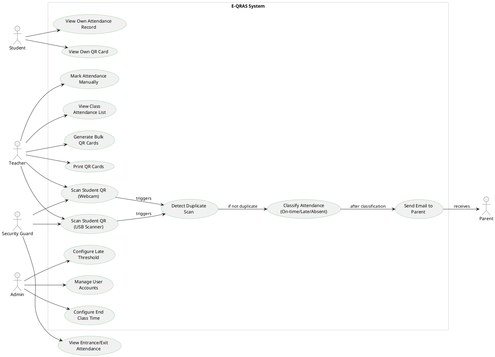

# E-QRAS Use Case Diagram



## Use Case Summary

### **Student (Restricted Access)**
- ✅ **View Own Attendance Record** — Can only see their personal attendance history
- ✅ **View Own QR Card** — Can view but cannot regenerate their QR code
- ❌ **Cannot**: Scan QR codes, modify attendance, access other students' records

### **Teacher**
- 📱 **Scan Student QR** (Webcam or USB barcode gun)
- 📋 **View Class Attendance List** — See attendance for their classes
- 🖨️ **Generate & Print Bulk QR Cards** — Create QR cards for students
- ✏️ **Mark Attendance Manually** — Override/correct attendance if needed

### **Security Guard (Entrance/Exit)**
- 📱 **Scan Student QR** (Webcam or USB barcode gun at gates)
- 🚪 **View Entrance/Exit Attendance** — See student entry/exit records
- ❌ **Cannot**: Modify class records, generate QR cards, manage users

### **System (Automated)**
- 🔄 **Detect Duplicate Scans** — Prevent multiple marks for same student
- ⏰ **Classify Attendance** — Mark as On-time, Late, or Absent based on threshold
- 📧 **Send Email to Parent** — Notify parent of scan with timestamp

### **Admin**
- ⚙️ **Configure Settings** — Set late threshold and end class time
- 👥 **Manage User Accounts** — Create/edit teachers and students
- 📊 **Audit Logs** — Monitor system activity (implied)

### **Parent**
- 📬 **Receive Email Notifications** — Passive actor, receives scan alerts

---

## Key Security Constraints

| Actor | Permission Level | Scope |
|-------|-----------------|-------|
| **Student** | Read-Only | Own data only |
| **Teacher** | Read-Write | Own class data + QR generation |
| **Security Guard** | Read-Write (Limited) | Entrance/exit scanning only |
| **Admin** | Full Access | System-wide |
| **Parent** | Read-Only (Email) | Own child's attendance |

---

## Data Flow: A Scan Event

```
Teacher scans QR
    ↓
[Duplicate Check] → If duplicate: discard
    ↓
[Time Classification] → Compare against settings.late_threshold
    ↓
[Insert Attendance Record] → To students.attendance table
    ↓
[Trigger Email] → Send notification to parent_email
    ↓
Parent notified
```
