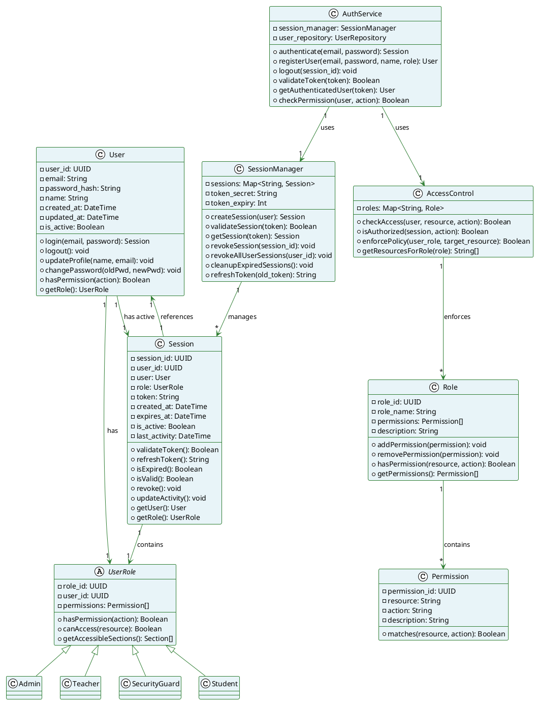

# E-QRAS Class Diagram: Core Authentication & Session Management

## Core Authentication & Session Classes



---

## Authentication Flow

```
User Input (email, password)
    ↓
AuthService.authenticate(email, password)
    ↓
Validate Credentials
    ↓
SessionManager.createSession(user)
    ↓
Generate JWT Token
    ↓
Return Session with Token
    ↓
Store Session (in-memory + Redis)
    ↓
User authenticated with permissions
```

---

## Authorization Flow

```
Request with Token
    ↓
SessionManager.validateSession(token)
    ↓
Check Token Expiry & Validity
    ↓
Retrieve Session & User Role
    ↓
AccessControl.checkAccess(user, resource, action)
    ↓
Compare against Role Permissions
    ↓
Grant or Deny Access
```

---

## Session Lifecycle

```
1. Login
   └─ User provides credentials
   └─ AuthService creates Session
   └─ SessionManager stores Session
   └─ JWT Token returned to client

2. Active Session
   └─ Client sends requests with token
   └─ SessionManager validates token
   └─ Session.updateActivity() called
   └─ Token refreshed if needed (sliding window)

3. Session Expiry
   └─ Session.isExpired() checks expiry time
   └─ SessionManager.cleanupExpiredSessions() runs periodically
   └─ User redirected to login if expired

4. Logout
   └─ User initiates logout
   └─ SessionManager.revokeSession() called
   └─ Token invalidated
   └─ Session removed from store
```
