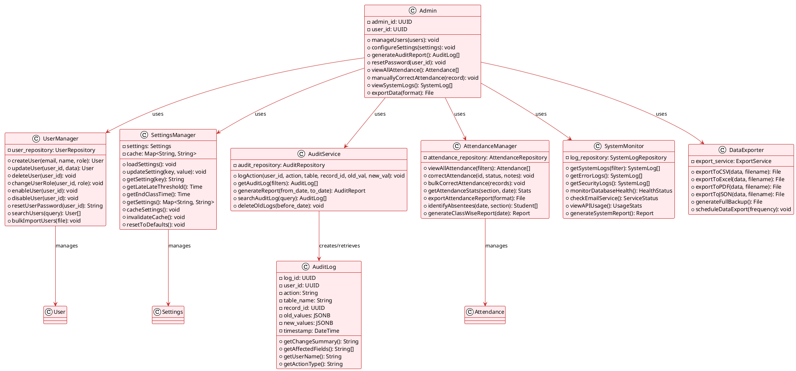

# E-QRAS Class Diagram: Admin Role

## Admin Responsibilities & Classes



---

## Admin Workflows

### User Management Workflow
```
Admin Opens User Management
    ↓
Select Action: Create/Update/Delete/Reset Password
    ↓
UserManager performs action
    ↓
AuditService logs the change
    ↓
Confirmation email sent to affected user
    ↓
System updates completed
```

### Settings Configuration Workflow
```
Admin Opens Settings Page
    ↓
View Current Settings
    ↓
Update late_threshold or end_class_time
    ↓
SettingsManager updates database
    ↓
Cache invalidated
    ↓
Changes take effect immediately
    ↓
AuditService logs configuration change
```

### Attendance Correction Workflow
```
Admin Searches Attendance Record
    ↓
Identifies error (wrong status, missing scan)
    ↓
AttendanceManager corrects record
    ↓
AuditService logs: old_values, new_values
    ↓
NotificationService sends parent email
    ↓
Correction marked as admin-made
```

### Report Generation Workflow
```
Admin selects report type
    ↓
Specify date range & filters
    ↓
AuditService or AttendanceManager queries data
    ↓
DataExporter formats data
    ↓
Generate PDF/CSV/Excel
    ↓
Download or email report
```

---

## Admin Permissions Matrix

| Action | Permission | Scope |
|--------|-----------|-------|
| **Create User** | create_user | System-wide |
| **Delete User** | delete_user | System-wide |
| **Reset Password** | reset_password | Any user |
| **Change Role** | manage_roles | System-wide |
| **Update Settings** | update_settings | System-wide |
| **View All Attendance** | view_all_attendance | All sections |
| **Correct Attendance** | correct_attendance | Any student |
| **View Audit Logs** | view_audit_logs | System-wide |
| **Export Data** | export_data | System-wide |
| **View System Logs** | view_system_logs | System-wide |

---

## Admin Dashboard Components

```
┌─────────────────────────────────────────┐
│         ADMIN DASHBOARD                 │
├─────────────────────────────────────────┤
│                                         │
│  [User Management] [Settings]           │
│  [Audit Logs]      [Attendance]         │
│  [Reports]         [System Health]      │
│  [Data Export]     [Activity Monitor]   │
│                                         │
│  ─────────────────────────────────────  │
│  Quick Stats:                           │
│  • Total Users: 125                     │
│  • Today's Scans: 3,456                 │
│  • Failed Emails: 2                     │
│  • System Health: 98.5%                 │
│                                         │
└─────────────────────────────────────────┘
```
