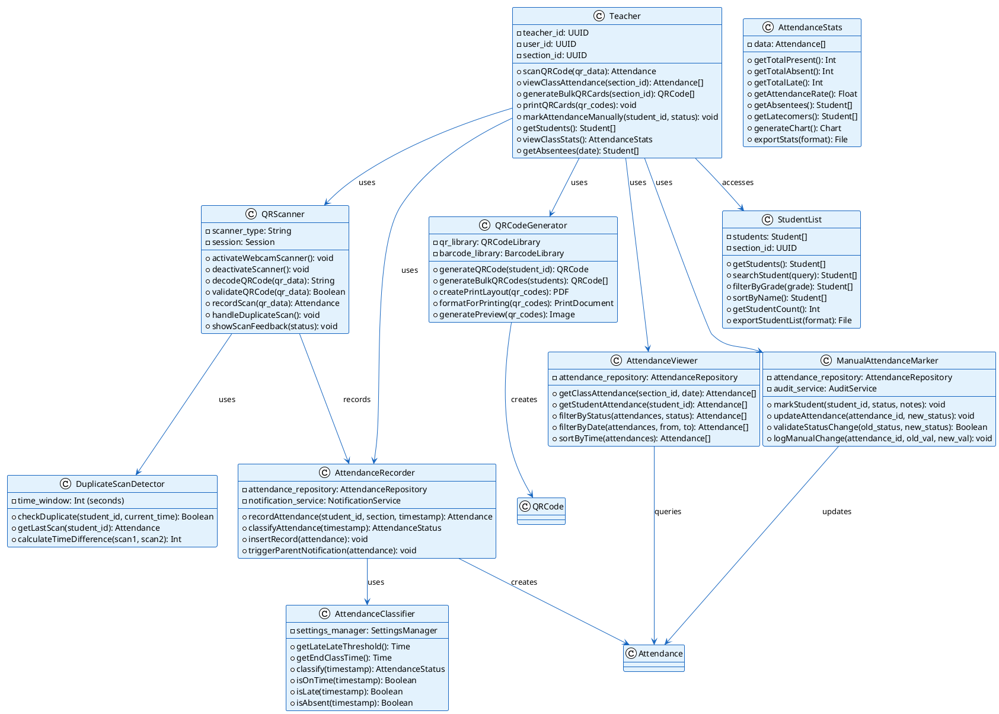

# E-QRAS Class Diagram: Teacher Role

## Teacher Responsibilities & Classes



---

## Teacher Workflows

### Class Attendance Scanning Workflow
```
1. Teacher Arrives at Class
   └─ Opens E-QRAS Dashboard
   └─ Selects their section/class
   
2. Activate QR Scanner
   └─ QRScanner.activateWebcamScanner()
   └─ Display live camera feed
   
3. Student Presents QR Card
   └─ QRScanner.decodeQRCode(qr_data)
   └─ Extract student_id
   
4. Check for Duplicates
   └─ DuplicateScanDetector.checkDuplicate(student_id)
   └─ If duplicate: show error, ignore scan
   └─ If new: proceed to recording
   
5. Classify Attendance
   └─ Get current time
   └─ AttendanceClassifier.classify(timestamp)
   └─ Compare with late_threshold from settings
   
6. Record Attendance
   └─ AttendanceRecorder.insertRecord(attendance)
   └─ Store in Supabase
   
7. Trigger Notification
   └─ NotificationService.sendScanAlert()
   └─ Send email to parent
   
8. Show Feedback
   └─ Display student name & status
   └─ Sound/visual confirmation
```

### QR Card Generation & Printing Workflow
```
1. Teacher Opens QR Card Generator
   └─ Select Grade/Section
   └─ Choose: All Students or Select Individual
   
2. Generate QR Codes
   └─ QRCodeGenerator.generateBulkQRCodes(students)
   └─ For each student:
      └─ Encode student_id
      └─ Generate barcode with student number
   
3. Create Print Layout
   └─ QRCodeGenerator.createPrintLayout(qr_codes)
   └─ Format for 8.5x11 paper
   └─ Add student name, grade, section
   
4. Generate Preview
   └─ QRCodeGenerator.generatePreview()
   └─ Display sample on screen
   
5. Adjust if Needed
   └─ Modify layout, spacing, font size
   
6. Print
   └─ Send to printer
   └─ Teacher receives physical cards
   
7. Distribute to Students
   └─ Each student gets a card
   └─ Valid until: valid_until date
```

### Manual Attendance Correction Workflow
```
1. Teacher Reviews Class Records
   └─ AttendanceViewer.getClassAttendance(section_id, date)
   └─ Identify missing or incorrect scans
   
2. Identify Error
   └─ Student marked absent but actually present
   └─ Student marked late but actually on-time
   └─ Duplicate scan not recorded
   
3. Select & Correct
   └─ ManualAttendanceMarker.updateAttendance(id, new_status)
   └─ Add notes: "Absent due to verified appointment"
   
4. System Validates
   └─ ManualAttendanceMarker.validateStatusChange()
   └─ Only allow valid transitions
   
5. Record Change
   └─ AuditService logs: old_status → new_status
   └─ Mark record as is_manual = true
   
6. Notify Parent
   └─ If status changed to "present":
   └─ Send email to parent about correction
   
7. Confirmation
   └─ Show success message
   └─ Record updated in real-time
```

---

## Teacher Permissions Matrix

| Action | Permission | Scope |
|--------|-----------|-------|
| **Scan QR (Class)** | scan_qr_class | Own section only |
| **View Class Attendance** | view_class_attendance | Own section only |
| **Generate QR Cards** | generate_qr_cards | Own section only |
| **Print QR Cards** | print_qr_cards | Own section only |
| **Mark Manually** | mark_attendance_manual | Own section only |
| **Access Students List** | view_students | Own section only |
| **View Stats** | view_stats | Own section only |

---

## Teacher Dashboard Components

```
┌──────────────────────────────────────────┐
│       CLASS ATTENDANCE DASHBOARD          │
├──────────────────────────────────────────┤
│                                          │
│  Section: Grade 9-A | Room 201           │
│  Date: 2024-05-13                        │
│                                          │
│  [Start Scanning] [View Attendance]      │
│  [Generate QR Cards] [Manual Mark]       │
│  [Class Stats]                           │
│                                          │
│  ──────────────────────────────────────  │
│  Today's Attendance:                     │
│                                          │
│  ✓ Present: 28 students                  │
│  ⏰ Late: 2 students                     │
│  ✗ Absent: 3 students                    │
│  ? Not Scanned: 1 student                │
│                                          │
│  Attendance Rate: 93.3%                  │
│                                          │
└──────────────────────────────────────────┘
```
