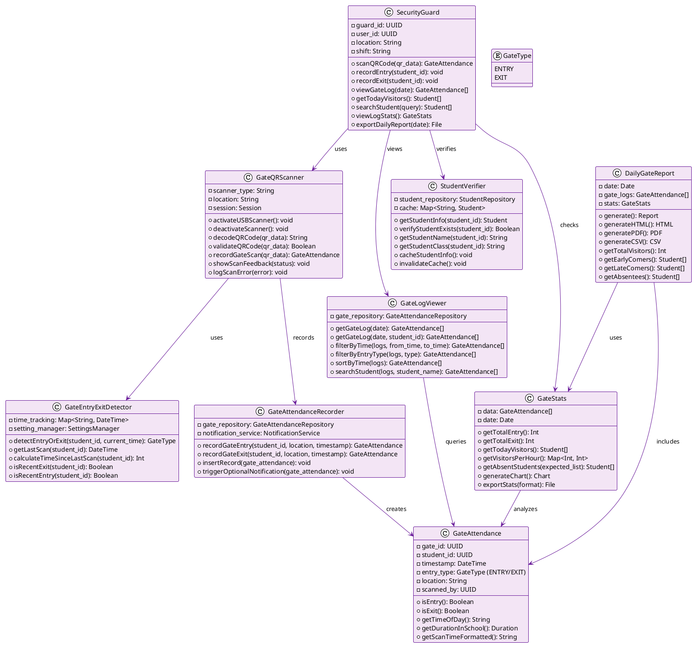

# E-QRAS Class Diagram: Security Guard Role

## Security Guard Responsibilities & Classes



---

## Security Guard Workflows

### Gate Entry/Exit Scanning Workflow
```
1. Student Arrives at School Gate
   └─ SecurityGuard positions at entry point
   └─ Student presents QR card
   
2. Activate Gate Scanner
   └─ GateQRScanner.activateUSBScanner()
   └─ Ready to receive keyboard input
   
3. Scan QR Code
   └─ Student swipes/scans QR card
   └─ GateQRScanner.decodeQRCode(qr_data)
   └─ Extract student_id from QR data
   
4. Detect Entry or Exit
   └─ GateEntryExitDetector.detectEntryOrExit(student_id)
   └─ Check time of day and last scan:
      └─ Morning & first scan → ENTRY
      └─ Afternoon & recent entry → EXIT
   
5. Record Gate Attendance
   └─ GateAttendanceRecorder.recordGateEntry/Exit()
   └─ Store: student_id, timestamp, location, type
   
6. Verify Student
   └─ StudentVerifier.getStudentInfo(student_id)
   └─ Display: Student Name, Class, Status
   
7. Show Feedback
   └─ Visual/Audio confirmation of entry/exit
   └─ Display student details on screen
   
8. Optional: Send Parent Notification
   └─ If configured: send entry/exit alert email
   
9. Continue Gate Operations
   └─ Ready for next student scan
```

### View Gate Activity Log Workflow
```
1. SecurityGuard Opens Gate Log Dashboard
   └─ Select Date (default: today)
   └─ Display all scans for the date
   
2. View Activities
   └─ GateLogViewer.getGateLog(date)
   └─ Show chronological list:
      └─ Time | Student | Class | Entry/Exit
   
3. Filter & Search
   └─ Filter by: Entry/Exit, Time Range
   └─ Search by: Student Name
   └─ Sort by: Time (ascending/descending)
   
4. Verify Attendance
   └─ Identify: Early arrivals, Late departures
   └─ Check: Unauthorized absences
   
5. View Statistics
   └─ GateStats.generateChart()
   └─ Show: Total entries, exits, visitors per hour
   
6. Generate Report
   └─ DailyGateReport.generate()
   └─ Export as PDF or CSV
```

### End of Day Report Workflow
```
1. Guard Completes Shift
   └─ Opens End of Day Report
   └─ Select date (usually today)
   
2. System Generates Report
   └─ DailyGateReport.generate()
   └─ Compile all gate scans
   
3. Report Shows:
   └─ Total Students Scanned: X
   └─ Total Entries: Y
   └─ Total Exits: Z
   └─ Students Still Inside: [List]
   └─ Unauthorized Absentees: [List]
   
4. Guard Verifies
   └─ Check for discrepancies
   └─ Note any anomalies
   
5. Export Report
   └─ Save as PDF for records
   └─ Send to admin if needed
```

---

## Security Guard Permissions Matrix

| Action | Permission | Scope |
|--------|-----------|-------|
| **Scan QR (Gate)** | scan_qr_gate | Own location only |
| **Record Entry** | record_entry | Own location only |
| **Record Exit** | record_exit | Own location only |
| **View Gate Log** | view_gate_log | Own location only |
| **View Today's Visitors** | view_visitors | Own location only |
| **Search Student** | search_students | School-wide |
| **View Gate Stats** | view_gate_stats | Own location only |
| **Export Daily Report** | export_report | Own location only |

---

## Security Guard Dashboard Components

```
┌────────────────────────────────────────────┐
│       GATE ATTENDANCE DASHBOARD             │
├────────────────────────────────────────────┤
│                                            │
│  Location: Main Gate | Shift: Morning      │
│  Time: 08:45:23 | Date: 2024-05-13        │
│                                            │
│  [QR Scanner Active]                       │
│                                            │
│  Last Scan: Priya Sharma (Grade 9-A)       │
│  Status: ✓ ENTRY at 08:45:19               │
│                                            │
│  ──────────────────────────────────────── │
│  [View Gate Log] [View Stats] [Report]     │
│  ──────────────────────────────────────── │
│                                            │
│  Today's Summary:                          │
│                                            │
│  Total Students Scanned: 342               │
│  Entries: 341 | Exits: 156                 │
│  Students Inside: 185                      │
│  Not Yet Arrived: 12                       │
│                                            │
│  Last Updated: 08:45:23                    │
│                                            │
└────────────────────────────────────────────┘
```

---

## Gate Scanning UI Layout

```
┌─────────────────────────────────────────┐
│        E-QRAS GATE SCANNER              │
├─────────────────────────────────────────┤
│                                         │
│                                         │
│        [Student QR Card Area]           │
│        Scan Below                       │
│                                         │
│        📱 Ready for Scan                │
│                                         │
│                                         │
│  ───────────────────────────────────   │
│                                         │
│  Last Scan:                             │
│  ✓ Aman Kumar (9-B)                     │
│  ENTRY @ 08:44:52                       │
│                                         │
│  ───────────────────────────────────   │
│                                         │
│  [View Daily Log] [End Shift]           │
│                                         │
└─────────────────────────────────────────┘
```
