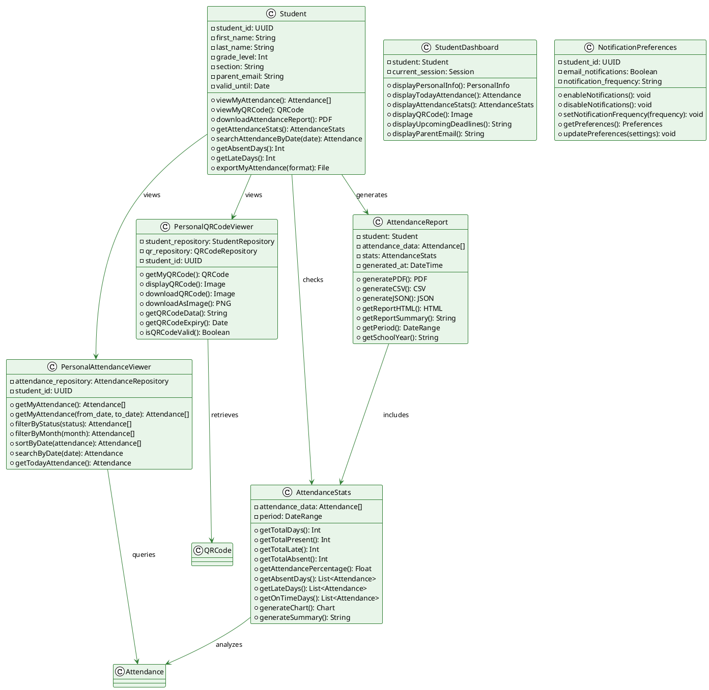

# E-QRAS Class Diagram: Student Role

## Student Responsibilities & Classes



---

## Student Workflows

### View Personal Attendance Workflow
```
1. Student Logs Into E-QRAS
   └─ Opens Student Dashboard
   └─ Sees: Welcome message, Today's Date
   
2. Access Attendance Records
   └─ Click: "View My Attendance"
   └─ PersonalAttendanceViewer.getMyAttendance()
   
3. Display Attendance List
   └─ Show all attendance records
   └─ Columns: Date | Time In | Status | Notes
   
4. Filter & Search Options
   └─ Filter by: Month, Status (Present/Late/Absent)
   └─ Search by: Date range, specific date
   
5. View Statistics
   └─ AttendanceStats.generateChart()
   └─ Show:
      └─ Total Present: X days
      └─ Total Late: Y days
      └─ Total Absent: Z days
      └─ Attendance Percentage: A%
   
6. Download Report
   └─ AttendanceReport.generatePDF()
   └─ Save attendance record as PDF
   └─ Share with parents if needed
```

### View QR Code Workflow
```
1. Student Opens E-QRAS Dashboard
   └─ Click: "My QR Code"
   
2. Display QR Code
   └─ PersonalQRCodeViewer.getMyQRCode()
   └─ Show QR code image on screen
   └─ Display student ID
   └─ Show expiry date: valid_until
   
3. Options:
   └─ [Download as Image] - Save QR code to device
   └─ [Print QR Code] - Send to printer
   └─ [Share QR Code] - Send to email/messaging
   
4. QR Code Information
   └─ Valid Until: [Date]
   └─ Status: Active/Expired
   └─ Size: Can be scaled for printing
   
5. Download/Print
   └─ PersonalQRCodeViewer.downloadAsImage()
   └─ Open print dialog
   └─ Send to printer or save as image
```

### Check Attendance Stats Workflow
```
1. Student Clicks "Attendance Statistics"
   └─ PersonalAttendanceViewer.getMyAttendance()
   └─ Retrieve all attendance records
   
2. System Calculates Stats
   └─ AttendanceStats.getTotalDays()
   └─ AttendanceStats.getTotalPresent()
   └─ AttendanceStats.getTotalLate()
   └─ AttendanceStats.getTotalAbsent()
   
3. Display Summary
   └─ Attendance Percentage: 92%
   └─ On-Time Days: 28
   └─ Late Days: 2
   └─ Absent Days: 1
   
4. View Trends
   └─ AttendanceStats.generateChart()
   └─ Bar chart showing attendance by month
   └─ Trend analysis (improving/declining)
   
5. Identify Gaps
   └─ AttendanceStats.getAbsentDays()
   └─ List dates when absent
   └─ Reason for absence (if noted by teacher)
```

### Generate Personal Report Workflow
```
1. Student Selects "Download Report"
   └─ Choose report format:
      └─ PDF (for printing/sharing)
      └─ CSV (for spreadsheets)
      └─ JSON (for data analysis)
   
2. Specify Date Range (Optional)
   └─ Default: Current school year
   └─ Options: Custom date range
   
3. Generate Report
   └─ AttendanceReport.generatePDF()
   └─ Compile attendance data
   └─ Include statistics
   └─ Add QR code
   
4. Report Content
   └─ Student Name & ID
   └─ Class & Section
   └─ Attendance Summary
   └─ Detailed Daily Records
   └─ Charts & Statistics
   └─ Generated Date & Time
   
5. Download/Share
   └─ Download to device
   └─ Open in browser
   └─ Email to parent
   └─ Print directly
```

---

## Student Permissions Matrix

| Action | Permission | Scope |
|--------|-----------|-------|
| **View Own Attendance** | view_own_attendance | Personal records only |
| **View Own QR Code** | view_own_qr | Personal QR code only |
| **Download Report** | download_own_report | Personal data only |
| **View Stats** | view_own_stats | Personal statistics only |
| **Search Attendance** | search_own_attendance | Personal records only |

---

## Student Dashboard Components

```
┌────────────────────────────────────────────┐
│      STUDENT ATTENDANCE DASHBOARD           │
├────────────────────────────────────────────┤
│                                            │
│  Welcome, Priya Sharma!                    │
│  Class: Grade 9-A | Section: Science-1     │
│  QR Code Valid Until: 2024-12-31           │
│                                            │
│  ──────────────────────────────────────── │
│  Today's Attendance                        │
│  2024-05-13                                │
│  [✓] PRESENT (08:45:19)                    │
│                                            │
│  ──────────────────────────────────────── │
│  This Month's Summary                      │
│                                            │
│  Total Days: 21                            │
│  ✓ Present: 19 days (90.5%)               │
│  ⏰ Late: 1 day (4.8%)                     │
│  ✗ Absent: 1 day (4.8%)                    │
│                                            │
│  ──────────────────────────────────────── │
│  [View Full Attendance] [My QR Code]       │
│  [Download Report]                         │
│                                            │
└────────────────────────────────────────────┘
```

---

## Student View - QR Code Card

```
┌──────────────────────────────┐
│    E-QRAS Student QR Code    │
├──────────────────────────────┤
│                              │
│        ██████████████        │
│        ██ ███   █ ████       │
│        ██ █  █  █ █ █████    │
│        ██ █   ██ █   ██ █    │
│        ██ █████  █ █████ █   │
│        ██████████████████████  │
│                              │
│    Student ID: S-000042      │
│    Name: Priya Sharma        │
│    Grade: 9-A                │
│    Valid Until: 2024-12-31   │
│                              │
│    [Download] [Print]        │
│                              │
└──────────────────────────────┘
```

---

## Student Attendance Record Example

```
┌────────────────────────────────────────────┐
│      MY ATTENDANCE RECORDS - MAY 2024       │
├─────────┬──────────┬────────┬──────────────┤
│ Date    │ Time In  │ Status │ Notes        │
├─────────┼──────────┼────────┼──────────────┤
│ 2024-05-01 │ 08:30 │ ✓ Present │          │
│ 2024-05-02 │ 09:15 │ ⏰ Late   │ Bus Delay│
│ 2024-05-03 │ 08:45 │ ✓ Present │          │
│ 2024-05-06 │ —     │ ✗ Absent  │ Sick     │
│ 2024-05-07 │ 08:40 │ ✓ Present │          │
│ 2024-05-08 │ 08:35 │ ✓ Present │          │
│ 2024-05-09 │ 08:50 │ ✓ Present │          │
│ 2024-05-10 │ 08:45 │ ✓ Present │          │
│ 2024-05-13 │ 08:45 │ ✓ Present │          │
└────────────────────────────────────────────┘
```

---

## Attendance Statistics Chart

```
Attendance by Month - 2024
┌─────────────────────────────────────┐
│ Month   │ Present │ Late │ Absent  │
├─────────┼─────────┼──────┼─────────┤
│ January │ ████████ 20 │ ██ 1 │ 0 │
│ February│ ███████ 18 │ █ 1 │ 2 │
│ March   │ █████████ 21 │ ██ 2 │ 0 │
│ April   │ ████████ 19 │ █ 1 │ 1 │
│ May     │ ███████ 17 │ █ 1 │ 0 │
└─────────────────────────────────────┘

Overall Attendance: 91.5%
```
