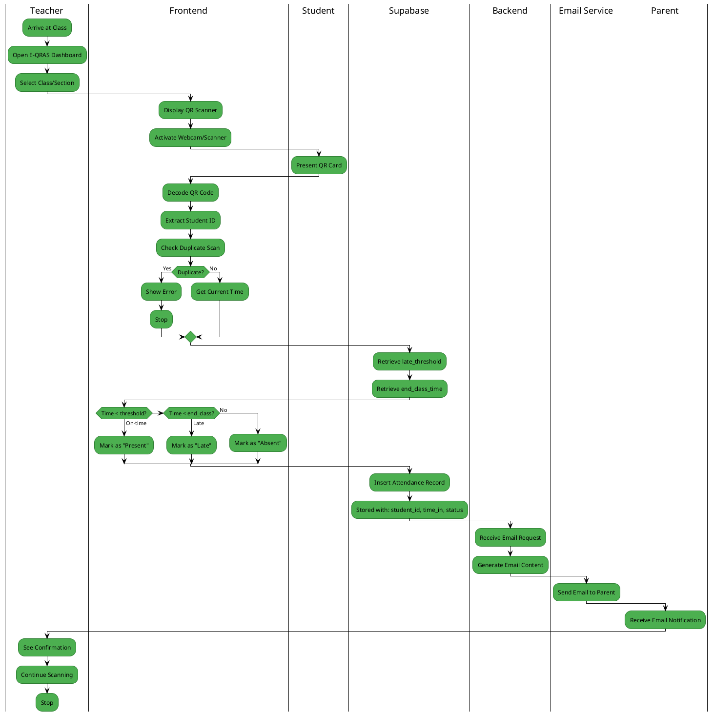
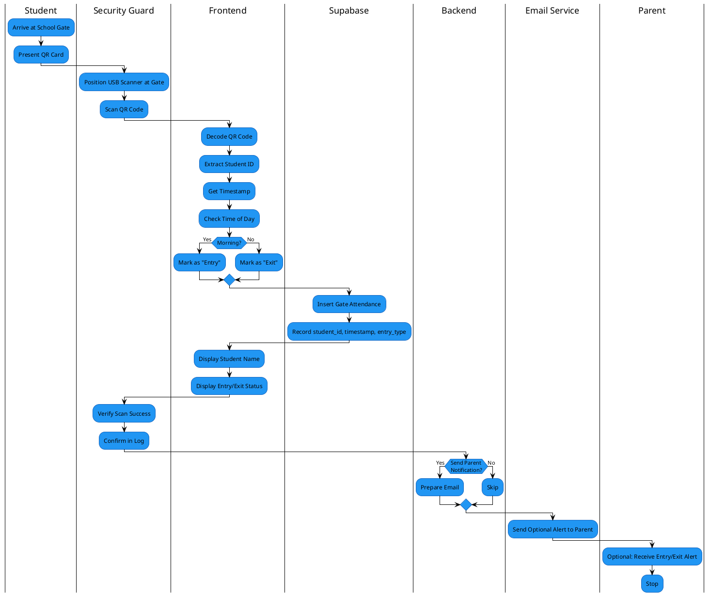
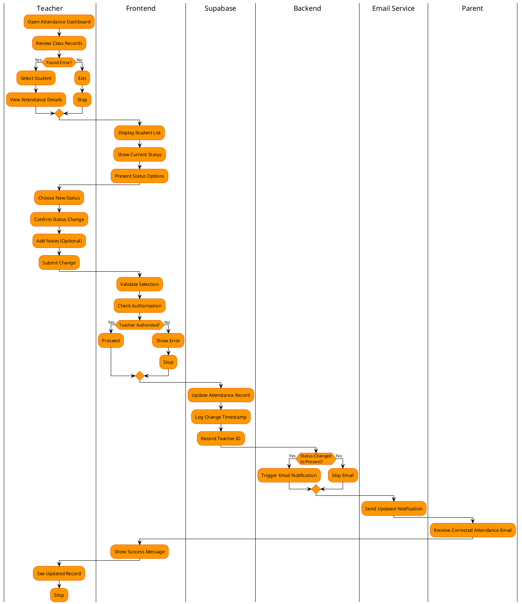
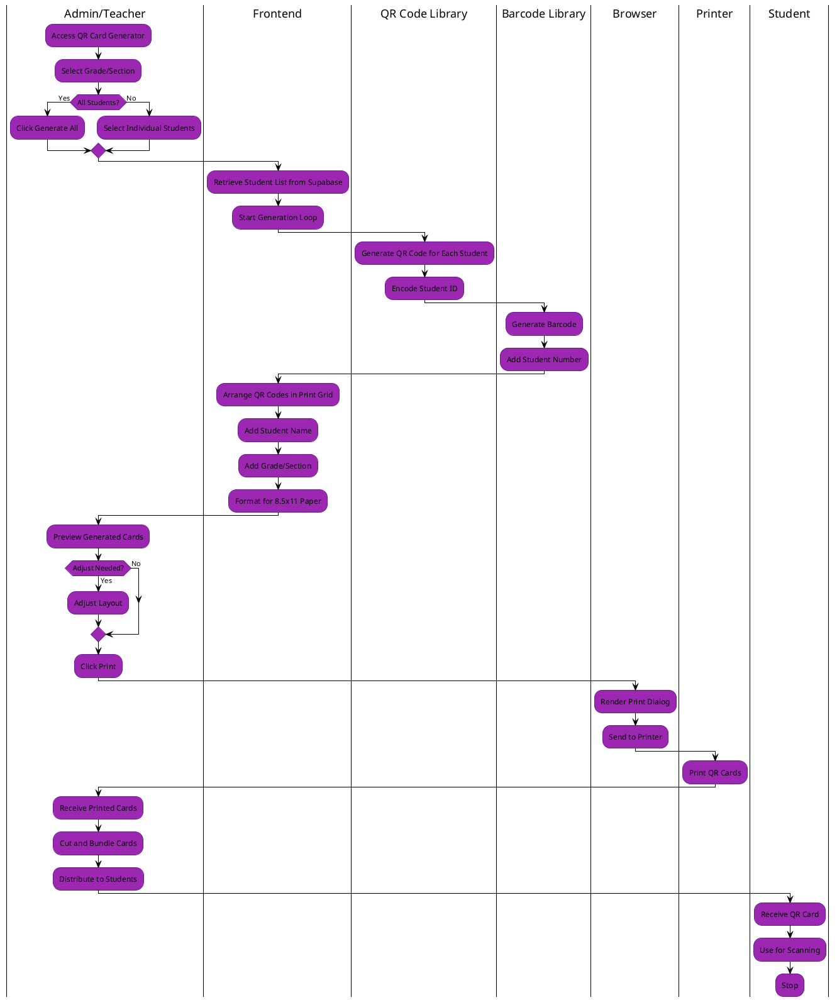

# E-QRAS Swimlane Diagrams

## 1. Class Attendance Scanning Process

---

## 2. Entrance/Exit Gate Scanning Process

---

## 3. Manual Attendance Correction Process

---

## 4. QR Card Generation & Printing Process

---

## Process Flow Summary

| Process | Primary Actor | Key Systems | Output |
|---------|---------------|-------------|--------|
| **Class Attendance** | Teacher | Frontend, Supabase, Email Service | Attendance record + Parent email |
| **Gate Entry/Exit** | Security Guard | Frontend, Supabase, Optional Email | Entry/exit log |
| **Manual Correction** | Teacher | Frontend, Supabase, Email Service | Updated attendance + Optional parent email |
| **QR Generation** | Admin/Teacher | Frontend, QR Library | Printable QR cards |

---

## Data Flow Notes

- **Frontend handles most logic**: QR decoding, duplicate detection, time classification, and form submissions
- **Backend is minimal**: Only handles email sending and JWT generation
- **Supabase is the single source of truth**: All data persisted there via direct frontend calls
- **Real-time responsiveness**: Users see immediate feedback on successful scans
