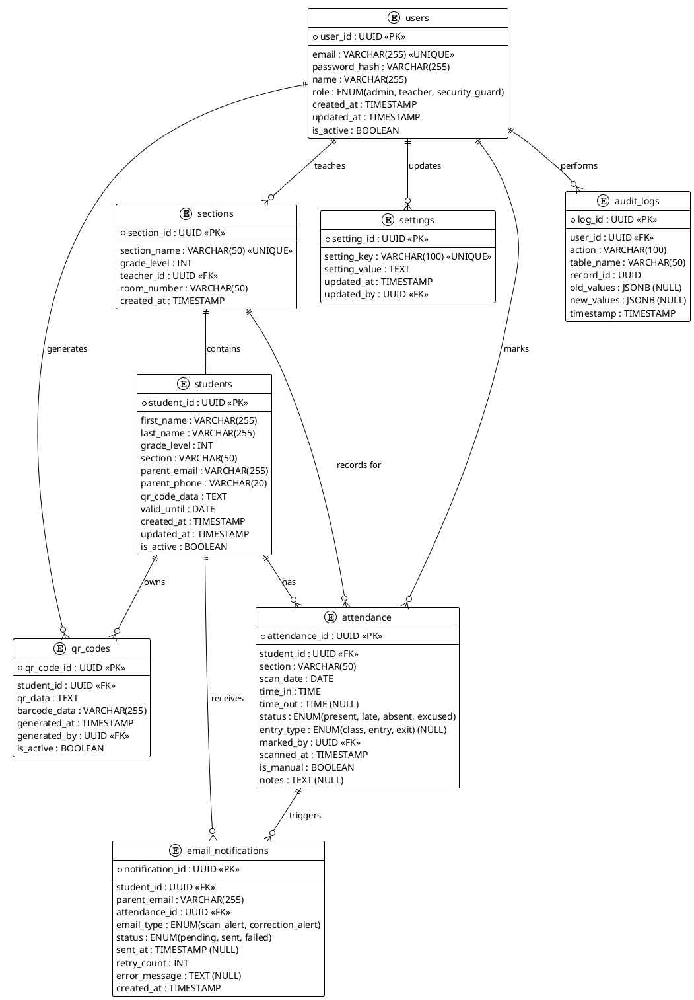

# E-QRAS Entity Relationship Diagram

## Main ER Diagram



---

## Table Schema Details

### `users` Table
**Role-Based Access Control**
```
- admin: Full system access, manage users, configure settings
- teacher: Scan QR for class, view class attendance, mark manually
- security_guard: Scan QR at gates, view entry/exit logs
```

### `students` Table
**Core student data**
- `qr_code_data`: Encoded student ID for scanning
- `valid_until`: When the student's QR card expires
- `parent_email`: Primary contact for attendance notifications

### `sections` Table
**Class/Section management**
- Maps students to classes
- Links to teacher responsible for the section
- Used for attendance filtering and reporting

### `attendance` Table
**Multi-purpose attendance tracking**
- Handles both class attendance and gate entry/exit
- `entry_type`: Distinguishes between class scans (NULL) and gate entry/exit
- `marked_by`: Teacher/Guard who performed the scan
- `is_manual`: Flag for manually corrected records
- Stores timestamps for late/on-time/absent classification

### `settings` Table
**System configuration (key-value store)**
```
Examples:
- late_threshold: "08:15" (time)
- end_class_time: "08:45" (time)
- email_enabled: "true"
- notification_delay: "300" (seconds)
```

### `qr_codes` Table
**QR code generation tracking**
- Tracks who generated QR codes and when
- Supports regenerating QR codes if needed
- Maintains both QR and barcode data

### `audit_logs` Table
**Audit trail for compliance**
- Records all changes to attendance
- Stores old/new values as JSONB
- Enables tracing corrections and manual overrides

### `email_notifications` Table
**Email delivery tracking**
- Tracks email status (pending, sent, failed)
- Supports retry logic for failed emails
- Logs error messages for debugging

---

## Key Relationships

| From | To | Cardinality | Description |
|------|-----|-------------|-------------|
| `users` | `sections` | 1:N | One teacher → Many sections |
| `users` | `attendance` | 1:N | One user → Many attendance records (marked_by) |
| `users` | `settings` | 1:N | One admin → Many config changes |
| `students` | `attendance` | 1:N | One student → Many attendance records |
| `students` | `qr_codes` | 1:N | One student → Many QR codes (for regeneration) |
| `students` | `sections` | N:N | Many students in many sections |
| `attendance` | `email_notifications` | 1:N | One attendance event → Many notifications |

---

## Data Flow Notes

### Attendance Creation
```
Student/Guard scans QR
    ↓
Frontend decodes QR_CODE_DATA → student_id
    ↓
INSERT INTO attendance (student_id, time_in, status, marked_by, scanned_at)
    ↓
Frontend/Backend triggers INSERT INTO email_notifications
    ↓
Email service sends to parent_email
```

### Manual Correction
```
Teacher opens Attendance Dashboard
    ↓
SELECTs attendance record
    ↓
UPDATEs attendance SET status = new_status, is_manual = true
    ↓
INSERTs into audit_logs (old_values, new_values)
    ↓
If status changed to "present", triggers email notification
```

### Settings Access
```
Frontend/Backend queries settings table
    ↓
Uses late_threshold and end_class_time for classification
    ↓
Admin updates settings
    ↓
Records change in audit_logs
```

---

## Indexes (Performance Optimization)

Recommended indexes for query performance:

```sql
-- Attendance queries
CREATE INDEX idx_attendance_student_date ON attendance(student_id, scan_date);
CREATE INDEX idx_attendance_section ON attendance(section);
CREATE INDEX idx_attendance_scanned_at ON attendance(scanned_at);

-- User authentication
CREATE INDEX idx_users_email ON users(email);

-- Student lookups
CREATE INDEX idx_students_qr_data ON students(qr_code_data);
CREATE INDEX idx_students_section ON students(section);

-- Email notifications
CREATE INDEX idx_email_notifications_status ON email_notifications(status);
CREATE INDEX idx_email_notifications_parent ON email_notifications(parent_email);

-- Audit trail
CREATE INDEX idx_audit_logs_timestamp ON audit_logs(timestamp);
CREATE INDEX idx_audit_logs_user ON audit_logs(user_id);
```

---

## Row-Level Security (RLS) Considerations

```sql
-- Students can view only their own attendance
SELECT * FROM attendance WHERE student_id = auth.uid();

-- Teachers can view only their section's attendance
SELECT * FROM attendance 
WHERE section = (
    SELECT section_name FROM sections WHERE teacher_id = auth.uid()
);

-- Security guards can view all entry/exit records
SELECT * FROM attendance WHERE entry_type IS NOT NULL;

-- Admins can view everything
SELECT * FROM attendance;
```
